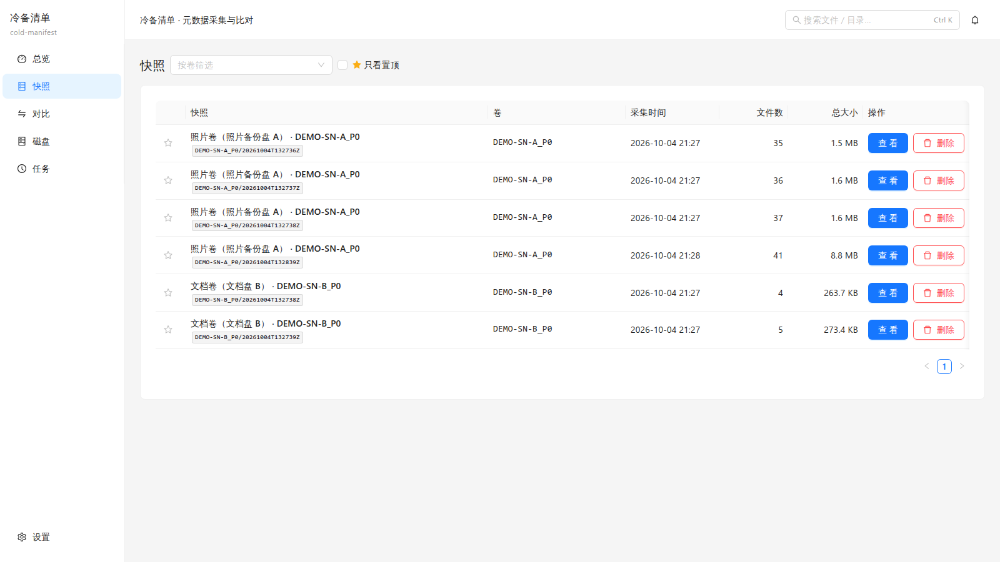
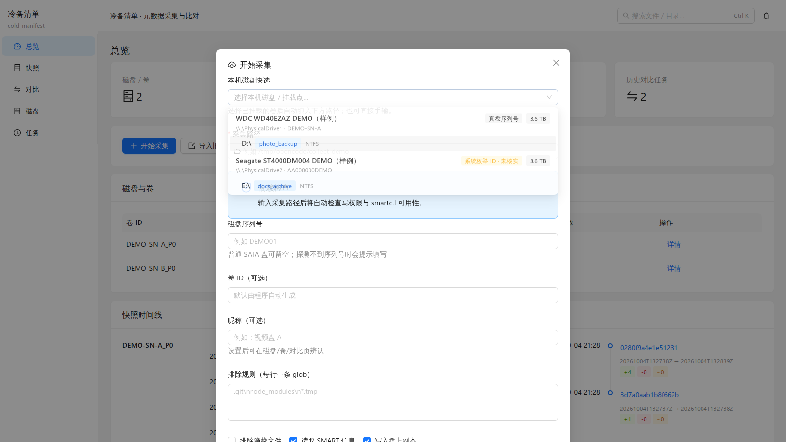
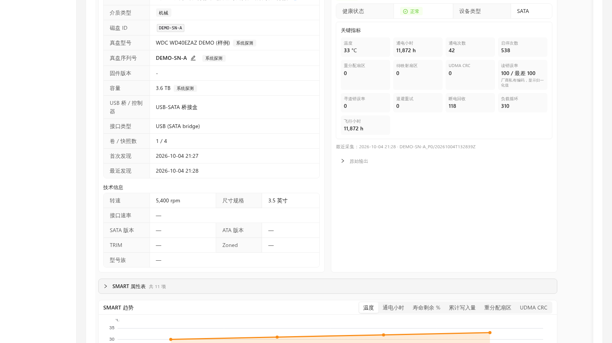
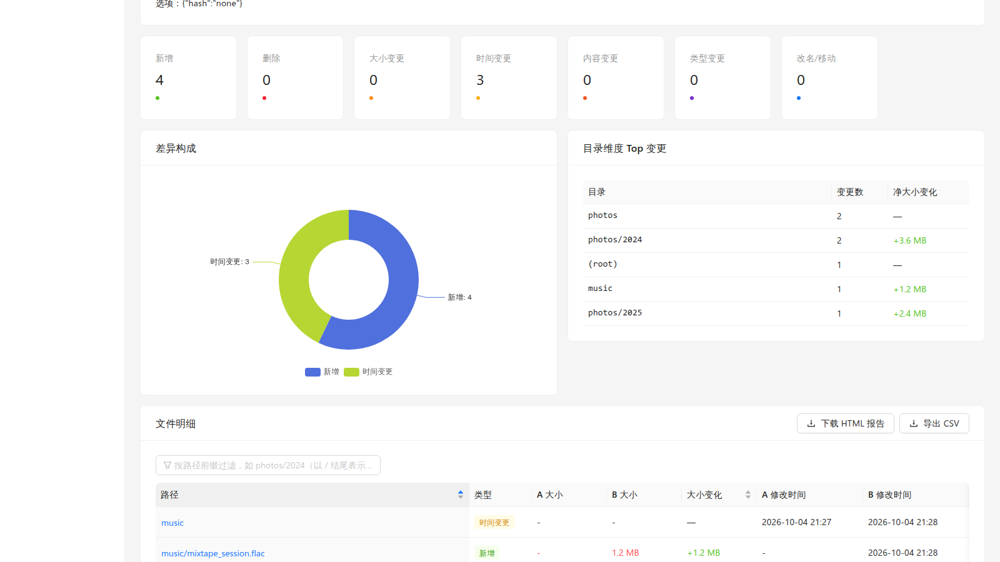
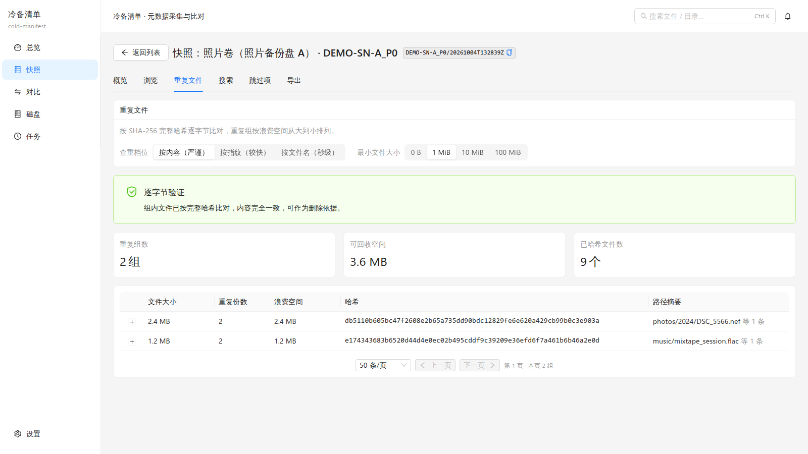
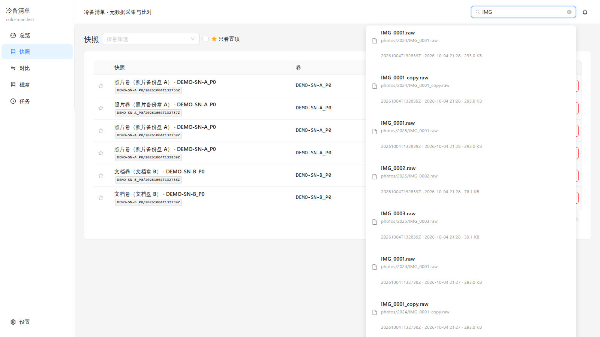

# 冷备清单 cold-manifest

**给冷备份硬盘做「清单 + 比对」的工具**：扫描一次冷备盘，之后随时回答——*这块盘里有什么？比上次多了什么、少了什么、改了什么？*

它**不搬数据**：全程只读你的盘，产出一份可长期保存的清单和可读的差异报告。CLI 命令名 `cldm`。



---

## 它解决什么问题

- **冷备盘的"黑箱感"**：盘在柜子里放了一年，谁也说不清里面到底有什么、和另一块盘什么关系。cold-manifest 把每块盘的目录结构、文件清单、大小与时间记录下来，随时可查。
- **换机、换盘、多盘的核对**：同一块盘在 A 机器采过一次、搬到 B 机器再采一次，或者一块盘拆成两块——两次快照一比，**新增 / 变化 / 丢失**一目了然，还能按目录下钻。
- **"我以为备份了"**：比对结果带**证据等级**——有哈希佐证、只有大小+时间、还是完全未知，心里有数；重复文件报告能直接告诉你哪些文件白占了几十 GB。

适合：个人/小团队的多块冷备盘、移动硬盘、USB 硬盘盒；也适合把旧盘数据搬到新盘后做一次验收。

---

## 功能亮点

### 采集：快、稳、可续

- 单遍 `scandir` 扫描，**3 万文件 / 200GB 的盘约 2 秒**（对比旧工具 v1 约为其 74% 耗时）；
- 多分区整盘批次采集（`--all-partitions`），一块盘一条任务组，进度实时推送（SSE）、随时取消；
- **断点续采**（`--resume`）：跑到一半断电/中断，重扫只补没走完的目录；
- 数据根写锁：同一数据根同时只有一个写者，不会写坏；
- 采集完成后，每个快照的库会自动备份一份到**对应磁盘上**的 `_coldmanifest/` 目录——盘还在，清单就在。

### 浏览与搜索

- 目录树懒加载（百万级目录流畅翻），统计画像（大小分布直方图、扩展名 Top、顶层目录排行、最大文件）；
- 单快照搜索：前缀匹配 / **FTS5 全文**（300 万条目建索引约 4.7 秒，查询比 `LIKE` 快约 50 倍）；
- **跨快照全局搜索**：顶栏 `Ctrl/Cmd+K`，在所有快照里搜「这个文件名在哪块盘上」；没有全文索引的快照会如实标注"本次为前缀匹配"。

### 对比：新增、变化、丢失

- 后台物化 diff，8 类变更 + 目录级汇总，10M×2 条目规模下约 52 秒；
- **证据等级**：`哈希级`（逐字节验证）/ `大小+时间` / `未知`，随对比结果与报告一起给出；
- 口径开关：大小写不敏感、忽略时间、忽略大小、显示未变化项——每种组合独立物化，可复现；
- 路径前缀过滤；结果支持 keyset 分页；
- **自包含 HTML 报告**（单文件、无 JS 依赖，可直接发给人）+ CSV 导出。

### 重复文件与按需哈希

- 查重三档：**按内容（严谨）/ 按指纹（较快）/ 按文件名（秒级零读盘）**，每档标注置信度，缺哈希时页面引导一键补算；
- 浪费空间统计 + 每组取样路径；300 万条目的库查重约 **1.15 秒**；
- 哈希默认**关闭**、按需启用：`full`（整文件 SHA-256）/ `sampled`（首尾+中段采样），跨快照缓存复用，支持"只对候选文件算"和"只精验某一组"。

### 磁盘健康与身份（SMART）

- 采集时自动读取，磁盘页也可「现在读取 SMART」现场诊断；失败给**可读原因**（权限/设备打不开/类型不识别/超时）与每次尝试的原始输出；
- **机械盘**：20+ 项 ATA 属性表（可折叠、异常行高亮）+ 13 项关键指标瓦片（通电时间/重分配/待映射/UDMA CRC/读错误率/磁头飞行小时…）+ 技术信息（转速/接口速率/SATA-ATA 版本/TRIM）；
- **固态盘**：剩余寿命、累计写入/读取量、备用空间、介质错误、异常断电、控制器忙时、多温度探头，并进趋势图；
- 数值按**语义**展示：希捷属性 240 显示真实小时数，厂商私有编码（1/7/195）显示归一化健康值而不是原始大数；
- **磁盘身份按真序列号锚定**（ATA 直通读取，盘符直读优先）：USB 硬盘盒上报的"系统枚举 ID"只作标注、绝不当身份；同型号同容量的盘并列时宁可不读也不猜；读不到真序列号则要求手填；
- `identity-check` 可对既有数据做"串盘"体检（同快照矛盾 / 跨快照漂移 / 跨盘序列号别名）。

### 管理

- 磁盘/分区**两级昵称**（比对历史里显示"移动硬盘A · 分区1"而不是长串 ID）；
- 快照星标置顶、备注、按卷筛选、趋势图；
- 删除管理：磁盘/卷删除**不级联**（名下还有快照或对比时拒绝并列出清单）；快照删除可选是否连盘上副本；对比结果可单独删除；
- 任务中心：SSE 进度、取消、删除终态记录；
- 界面细节：表格列宽可拖拽（按表记忆）、统一分页（行数 20/50/100/200 + 上下页，**页数写进网址**，刷新还在原页）、右键菜单快捷跳转、服务端排序。

---

## 界面预览

| | |
|---|---|
|  |  |
| 采集：磁盘快选，直接显示 ATA 真序列号 | 磁盘详情：身份卡、SMART 关键指标、趋势 |
|  |  |
| 对比：差异汇总 + 证据等级 + 明细 | 重复文件：三档置信度 + 浪费空间 |
|  |  |
| 全局搜索：跨快照按文件名找盘 | 总览：卷与快照一览 |

---

## 快速开始

**Windows（免安装）**：解压 `cold-manifest-win.zip` → 双击 `packaging\windows\start.cmd`（建议"以管理员身份运行"，USB 盘的 SMART 读取需要管理员）→ 浏览器打开 `http://localhost:8765`。命令行用 `packaging\windows\cldm.cmd`。

**Linux**：`packaging/linux/setup.sh` → `start.sh`（端口用 `CLDM_PORT` 覆盖）。

**从源码跑**（开发环境为 WSL2 + Python 3.12 + uv）：

```bash
~/.local/bin/uv pip install -e ".[dev]" --python .venv-wsl/bin/python
.venv-wsl/bin/cldm serve                 # 后端（默认 0.0.0.0:8765）
cd frontend && npm run dev               # 前端（另开终端，http://localhost:5173）
.venv-wsl/bin/python -m pytest -q        # 测试
```

数据根约定：`catalog.db` 与各快照库都在 `CLDM_DATA_ROOT`（默认 `./data`）下；盘上副本写在各卷根的 `_coldmanifest/`。**拷贝数据根 = 迁移/换机**（停服务后整目录拷走即可，路径无所谓）。

常用命令速查：`cldm collect / diff / hash / duplicates / verify-copy / report / export / delete / nickname / integrity-check / identity-check / rebuild-catalog`（完整清单与参数见 `docs/升级方案-v0.3.md` 附录 A；`cldm --help` 亦可）。

---

## 可靠性与真机验证

这一版的功能不是只在测试里跑过：磁盘身份、SMART、USB 硬盘盒、多盘并列等场景都用**真实硬件**（希捷/东芝/西数/三星/致钛等盘的实机数据）反复验过，并修掉了几个真机才暴露的问题——例如"系统枚举把硬盘盒 ID 当序列号""两块同容量盘并列读错盘""希捷打包编码被当成小时数"。完整案例（现象 → 根因 → 解法 → 提交号）见 [`docs/升级方案-v0.3.md`](docs/升级方案-v0.3.md) 的「真机 UAT 问题与解决方案」一节；真机复测点见 [`docs/Windows-真机复验清单.md`](docs/Windows-真机复验清单.md)。

平台注意事项（exFAT/FAT32 上的 WAL 回退、长路径、Windows 保留文件名、UTF-8 控制台、USB 桥 SMART 等）见 [`docs/Windows-兼容性排查.md`](docs/Windows-兼容性排查.md)。

---

## 项目规模与技术栈

| | |
|---|---|
| 实现代码 | **25,255 行**（Python 后端 13,376 + React 前端 11,847 + 脚本/打包 886） |
| 测试代码 | **13,496 行**，55 个文件，**750+ 用例全绿**（另有 10M 级压测报告） |
| 后端 | Python 3.12 · FastAPI · SQLite（内容表 + FTS5 全文 + 物化 diff）· 单遍扫描 · SSE |
| 前端 | React 19 · TypeScript · Vite · Ant Design 6 · ECharts · React Query |
| 分发 | Windows 免安装 zip（含离线依赖）· Linux 启动脚本 · CLI(`cldm`) 与 Web UI 同源 |

---

## 定位与边界

- **只读盘、只有清单**：不做数据同步、不做加密和去重写回——你的数据原样不动；
- 定位为**单机 / 内网工具**：无账号与鉴权体系，请勿直接暴露到公网；
- 冷备 ≠ 备份策略本身：它帮你**看清**备份内容与变化，不替代多副本、异地保存。

---

## 文档索引

| 文档 | 内容 |
|---|---|
| [`docs/升级方案-v0.3.md`](docs/升级方案-v0.3.md) | 需求与实现现状、API/CLI 全量清单、路线图、**真机 UAT 问题与解决方案** |
| [`docs/UX-架构-v0.3.md`](docs/UX-架构-v0.3.md) | 页面结构、交互约定、组件清单 |
| [`docs/Windows-运行说明.md`](docs/Windows-运行说明.md) / [`docs/Linux-运行说明.md`](docs/Linux-运行说明.md) | 平台运行手册（含常用命令） |
| [`docs/Windows-真机复验清单.md`](docs/Windows-真机复验清单.md) | 每轮真机复测点与回传模板 |
| [`docs/Windows-兼容性排查.md`](docs/Windows-兼容性排查.md) | Windows/exFAT/USB 桥等兼容性问题与结论 |
| [`docs/压测-10M.md`](docs/压测-10M.md) | 1000 万条目级性能报告 |
